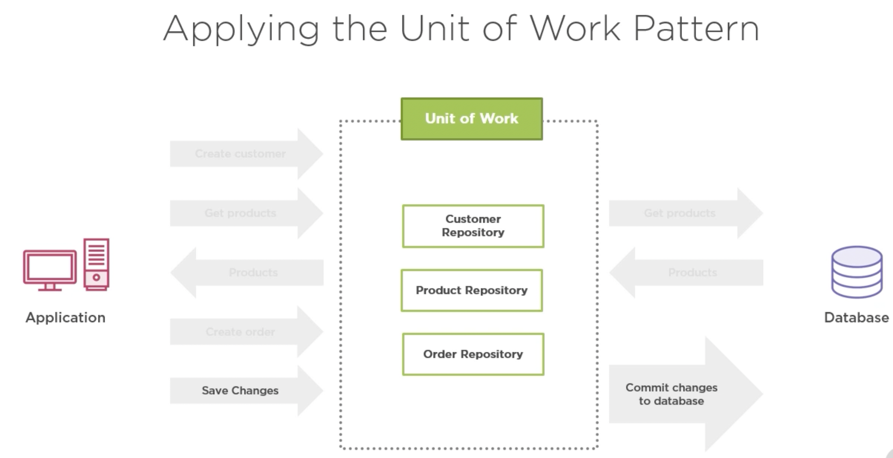

# Theory
In Layman's terms: this data access layer pattern allows an application to be less chatty with the database.

It is a good addition to the [repository pattern](), allowing you to reference multiple repositories inside of a unit of work class.

For example, if you want to add new data to customer and order table at the same time, instead of doing this in two transactions, we can do it in one.

Applying unit of work pattern:
    
    1. Define IUnitOfWork interface
    2. Define UnitOfWork class that implements the interface
        - This class must contain DbContext, References to all IRepositories and implement a context.SaveChanges() method.

This method works because all of the repositories in this new class share the same context.

## Diagram of it in action:
We have a new task that our application must perform in one single db operation:

    1) Create customer
    2) Create order



# Why use it?
In high performant environments limiting the communication can be crucial

Note: you should only use this pattern in an application that does a lot of communication with the database. Which is more likely to be a complex application. Don't need to use in simple applications as it adds more complexity in turn.

# How to implement
We have a usecase where at the moment, the application creates a new order without checking whether the customer already exists in the customer table. This is not a scalable solution as you are unnecessarily populating the customer table with data that is already there.

So first thing to do is to update the `OrderController`'s `create` method, to first check if customer already exists before creating the order:

```c#
// Check if customer already exist by name and if yes we don't want to create new one
var customer = _customerRepositor.Find(c => c.Name == model.Customer.Name).FirstOrDefault();

if (customer != null)
{
    // Customer already exists so just update their details
    customer.ShippingAddress = model.Customer.ShippingAddress;
    customer.PostalCode = default;
    customer.City = model.Customer.City;
    customer.Country = model.Customer.Country;

    _customerRepositor.Update(customer);
    _customerRepositor.SaveChanges();
}

// If customer doesn't exist then go inside this condition and create new customer
else
{
    customer = new Customer()
    {
        Name = model.Customer.Name,
        ShippingAddress = model.Customer.ShippingAddress,
        City = model.Customer.City,
        PostalCode = model.Customer.PostalCode,
        Country = model.Customer.Country
    };
}

var order = new Order
{
    LineItems = model.LineItems
        .Select(line => new LineItem { ProductId = line.ProductId, Quantity = line.Quantity })
        .ToList(),

    Customer = customer
};

_orderRepository.Add(order);

_orderRepository.SaveChanges();
```

The issue with just this solution is that if you try creating an order for an existing customer, then without unit of work pattern you will have an exception. This is because EF Core creates an instance to the `DbContext` for each repository. So one for customer and one for order and the issue if the different repositories will not be able to reference each others entities. We can fix this problem and also reduce the number of operations performed on the database from two to one, using the unit of work pattern.

## Implementation

1. [Define unit of work interface]()
2. [Define unit of work class]()

# Consuming
[Update `OrderController` and `CustomerController` to instead use `UnitOfWork` then the individual repositories]()
